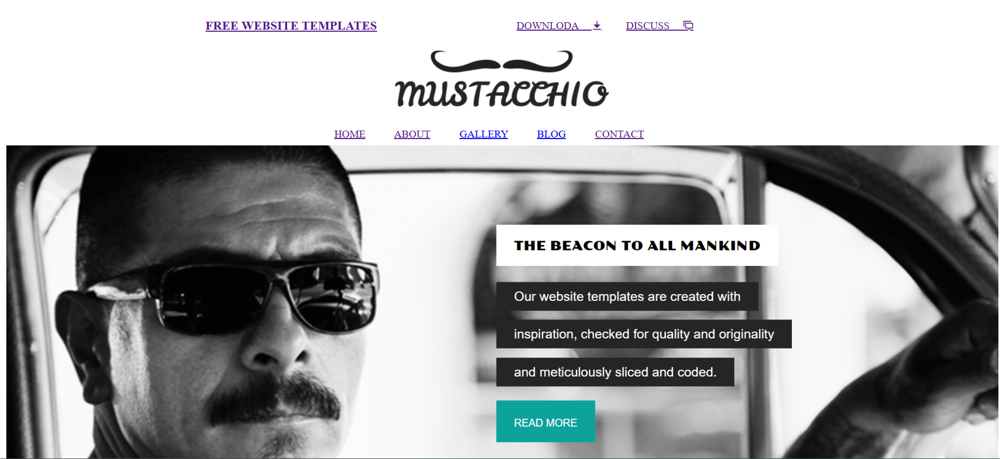
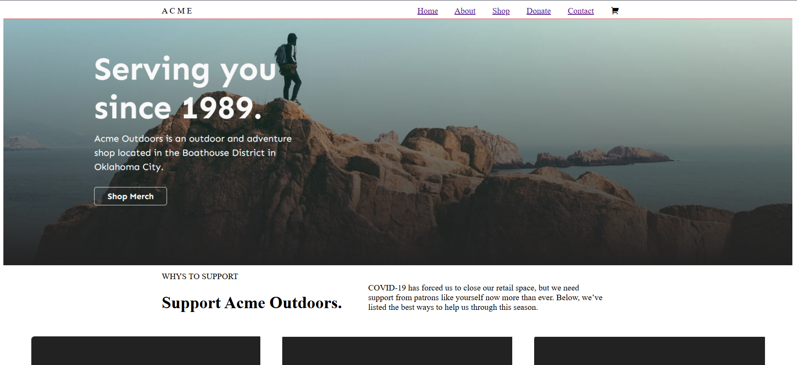

# 🌴 Travel Website (HTML Only)

A basic static travel website built using only HTML. It showcases beautiful destinations, trip packages, and travel-related content without using CSS or JavaScript.

## 🎯 Objective

The goal of this project is to design a simple travel website using **pure HTML** only.  
It focuses on understanding HTML structure, semantic tags, and basic page linking/navigation.

## ✨ Features

- 🗺️ Homepage with travel intro and banner
- 🌍 List of destinations or tour packages
- 📷 Image placeholders for scenic spots
- 📄 Multiple pages using internal links
- 🧭 Navigation bar (using only HTML)

## 🛠️ Tech Stack

- HTML5 (No CSS / No JavaScript)

 

# 👨🏻 Mustacchio – HTML Only Website

A simple, static website dedicated to "Mustacchio" — built using **only HTML**.  
No CSS. No JavaScript. Just pure semantic HTML.

## 🎯 Project Objective

The goal of this project is to create a basic website using only HTML tags.  
This helps in understanding page structure, links, content flow, and navigation.

## ✨ Features

- 📄 Static homepage about Mustacchio
- 🧔 Gallery-style images (using ``)
- 📜 About and Contact pages
- 🔗 Page linking via basic navigation

## 🛠️ Tech Stack

- ✅ HTML5 only  
- ❌ No CSS  
- ❌ No JavaScript  

 

# 🏢 ACME Corporation – HTML Only Website

A basic static website for **ACME Corporation**, built entirely using **HTML only**.  
No CSS. No JavaScript. Pure semantic structure.

## 🎯 Project Objective

The purpose of this project is to create a simple company website using only HTML, focusing on structure, content flow, and page linking.

## ✨ Features

- 🏠 Homepage with company intro
- 🧾 About page for company details
- 📦 Products page showcasing offerings
- ✉️ Contact page with form layout
- 🧭 Internal navigation using anchor tags

## 🛠️ Tech Stack

- ✅ HTML5  
- ❌ No CSS  
- ❌ No JavaScript  

 

# 🍕 Domino's Pizza – HTML Only Website Clone

A simple HTML-only clone of the Domino’s Pizza website.  
No CSS, no JavaScript – just pure semantic HTML to represent structure and content.

## 🎯 Project Objective

To build a basic, static pizza ordering site using only HTML.  
Perfect for beginners learning how to structure web pages with real-world context.

## ✨ Features

- 🏠 Home Page with Pizza Introduction
- 🍕 Menu Page with pizza names and descriptions
- 🛒 Order Page with form layout (non-functional)
- 📞 Contact Page with address and phone
- 🔗 Internal navigation using `<a>` tags

## 🛠️ Tech Stack

- ✅ HTML5  
- ❌ No CSS  
- ❌ No JavaScript

